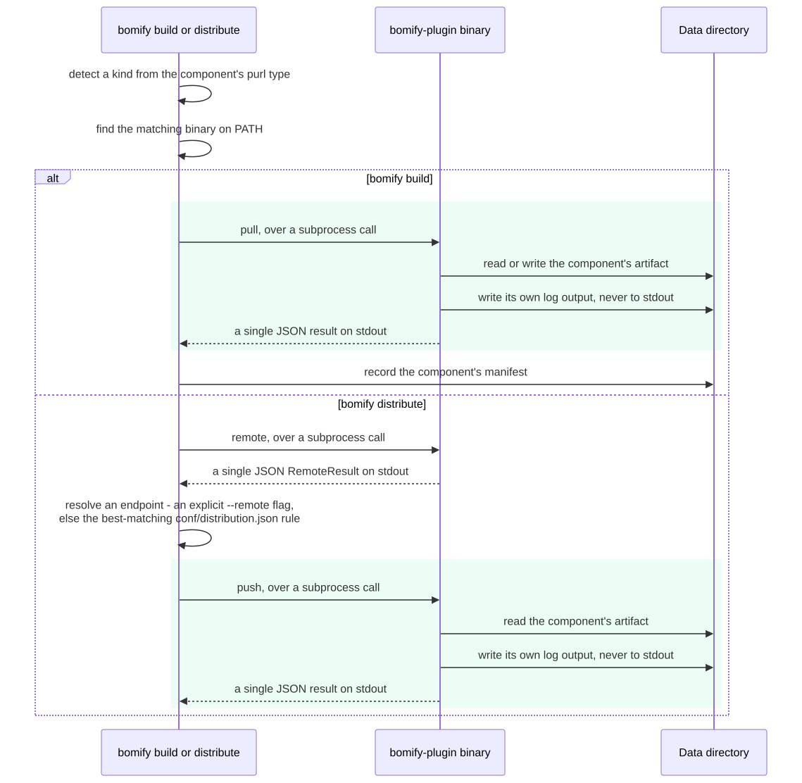

# Architecture

This document explains how bomify is put together internally: the on-disk
data directory, the plugin architecture components are built through, how a
build's bookkeeping (manifests and tags) works, and how packages move to and
from an OCI registry or a local tarball. It's aimed at anyone modifying
bomify itself, not at CLI users — see the [README](README.md) and
[`docs/reference`](docs/reference) for that.

Diagram sources live under [`docs/diagrams`](docs/diagrams) as standalone
`.mmd` files (openable directly in the
[Mermaid Live Editor](https://mermaid.live)); this document embeds the
`.svg` rendered from each. After editing a `.mmd` file, regenerate its
`.svg` with `make diagrams`.

## Mental model

bomify's design deliberately mirrors Docker's: a **package** is built from a
CycloneDX SBOM the way an image is built from a Dockerfile, a **tag** points
a human-readable name at one, and `packages`/`tag`/`package rm`/`save`/`load`
all have a direct Docker analogue (`images`/`tag`/`rmi`/`save`/`load`). The
things Docker calls "layers" are here the individual **components** an SBOM
describes — each pulled independently, cached independently, and reused
across builds by content hash.

Every component's actual fetch/build/publish logic lives outside bomify
itself, in an external plugin binary — bomify only orchestrates: parse the
SBOM, dispatch each component to the right plugin, and record what happened.

## Data directory

Everything bomify reads or writes lives under one directory (`~/.bomify` by
default, or `--data-dir`):

*Source: [`docs/diagrams/data-directory.mmd`](docs/diagrams/data-directory.mmd)*

`conf/distribution.json` records `bomify distribute`'s remote-endpoint
rules (see [`internal/distribution`](internal/distribution) and `bomify
distribution create`) — a fallback for any component not given a matching
`--remote` on the command line.

Two independent things share the flat `manifests/` directory and the same
`<hash>.json` naming scheme, distinguished only by which hash space they're
keyed on:

- **A build's own manifest** (see [`internal/build`](internal/build)) is the
  original SBOM file itself, copied verbatim and keyed by its SHA-256
  content hash. This is what `repositories.json` tags point at.
- **A component's pull manifest** (see [`internal/plugin`](internal/plugin))
  records one component's SBOM entry (with its computed hash merged in) and
  is keyed by a hash of that component's purl (`plugin.PurlHash` — this
  stays in `internal/plugin` since it's bomify's own on-disk layout, not
  part of the plugin-facing contract). This is what makes an identical
  component pulled by two different SBOMs — or the same SBOM built twice
  — get reused instead of re-pulled. `internal/oci/pull` writes this same
  manifest for a component restored from a registry, so a later `bomify
  build` needing the same purl reuses it too.

`logs/<purlHash>.log` is a plugin's own log output for one pull/push/remote
invocation for that component, named after the same purl hash as its
manifest and layers directory — but unlike everything else here, it's
transient: it exists only for the duration of that invocation and is
removed once the plugin exits. See [Plugin architecture](#plugin-architecture)
below.

Everything is content-addressed and every write that matters is atomic (a
temp file/directory renamed into place once fully written and verified, see
`internal/oci/pull`), so a crash mid-write never leaves a corrupt manifest or
layer behind — only ever a missing one, which just triggers a redo.

## Plugin architecture

A `bomify-plugin-<kind>` binary can implement either, both, or neither of
two entirely independent plugin classes:

- **Component plugins** — `component pull`/`component push`/`component
  remote`, described below, which `bomify build`/`bomify distribute` use
  to fetch and publish the individual components an SBOM describes.
- **SBOM generation plugins** — `sbom generate`, described in its own
  subsection [further down](#sbom-generation), which `bomify sbom
  generate` delegates to in order to build a fresh SBOM for a deployment
  medium. It shares nothing with the component contract beyond the
  `bomify-plugin-<kind>` binary-naming/discovery convention.

### Component plugins

Neither `bomify build` nor `bomify distribute` know how to fetch or publish
anything themselves. For each SBOM component they:

1. **Detect** a "kind" from the component's purl type (`plugin.Detect`) —
   `pkg:oci/nginx@1.27` is kind `oci`, `pkg:helm/...` is kind `helm`, and so
   on. A component with no purl, or an unparseable one, fails immediately.
2. **Find** a `bomify-plugin-<kind>` executable on `PATH` (`plugin.Find`).
3. **Delegate** to it via a small subprocess contract: `component pull`/
   `component push` subcommands taking
   `--purl`/`--output`/`--hash`/`--log`/`--log-color` or
   `--purl`/`--input`/`--remote`/`--log`/`--log-color`, the plugin doing the
   real work and reporting a single JSON `{outputPath, message, hash}`
   object on stdout. `bomify distribute` additionally calls a `component
   remote` subcommand (`--purl`/`--log`/`--log-color`) before `component
   push`, to learn where a component's content currently lives — a pure,
   stateless query reporting `{remote}` — and resolves the actual
   destination itself: an explicit `--remote <kind>=<endpoint>` flag
   first, else the best-matching rule in `conf/distribution.json` (see
   [`internal/distribution`](internal/distribution)), whose `--match`
   compares against exactly what `remote` reported.

A plugin must never write general logging to stdout (reserved for that one
JSON result) or stderr (reserved for a single fatal message bomify surfaces
on failure) — instead it logs to the file named by `--log`,
`<baseDir>/logs/<purlHash>.log` (`pkg/plugin`'s `plugin.OpenLog` gives a ready-made
`*slog.Logger` for this, in bomify's own `tint`-based format). `--log-color`
tells the plugin whether to include ANSI color codes in that output;
bomify sets it to whether its own stdout is a terminal
(`logging.SupportsColor`), since only bomify — which streams the file
there — knows whether that matters. `plugin.Pull`/`plugin.Push` create the
log file fresh before invoking the plugin and, only when bomify itself is
run with `--verbose`, stream its content live to bomify's own stdout —
each line prefixed with `[<verb> <purl>]` so lines from concurrent
pulls/pushes streaming at once stay distinguishable — as the plugin writes
to it. Either way, the file exists solely to make that streaming
possible — it's not a persistent log, and is deleted again once the
plugin exits, whether it succeeded or failed.

Both `bomify build --check` and `bomify distribute --check` skip step 3's
real transfer: they pass `--check=true` (and neither `--output` nor
`--input`) to `pull`/`push`, asking the plugin to do the cheapest
verification it can — existence and authorization — that a real
pull/push would succeed, without touching any content. `plugin.CheckPull`/
`plugin.CheckPush` are the stateless counterparts of `plugin.Pull`/
`plugin.Push` this uses: like `remote`, a check never creates a pid file,
manifest, or component directory, and `bomify build --check` records
nothing afterward, since nothing was actually pulled.

See [`plugins/README.md`](plugins/README.md) for the first-party plugins
bomify ships (`oci`, `helm`, `generic`), and
[`plugins/COMPONENT-CONTRACT.md`](plugins/COMPONENT-CONTRACT.md) for the full, authoritative
specification of the component contract above — required/optional flags,
`--check` mode, the exact `Result` JSON schema, valid hash algorithm
names, and the logging contract — that a third-party plugin must
implement.

*Source: [`docs/diagrams/plugin-dispatch.mmd`](docs/diagrams/plugin-dispatch.mmd)*

### SBOM generation

`bomify sbom generate <kind> [flags]` (`cmd/sbom.go`) is a much thinner
piece of orchestration than the component dispatch above: it looks up
`bomify-plugin-<kind>` on `PATH` (the same `plugin.Find` component
dispatch uses) and execs it as `bomify-plugin-<kind> sbom generate
[flags]`, wiring the plugin's stdin/stdout/stderr directly to bomify's
own and propagating its exit code — nothing more. `flags` is passed
through completely unparsed; bomify imposes no flags, JSON result shape,
`--log` file, `--check` mode, caching, or concurrency control here, unlike
the component contract above. This is deliberate: a plugin's `sbom
generate` must be just as usable run directly
(`bomify-plugin-<kind> sbom generate [flags]`) as through
`bomify sbom generate <kind> [flags]`, since bomify contributes nothing
to the operation beyond locating the binary. See
[`plugins/SBOM-CONTRACT.md`](plugins/SBOM-CONTRACT.md) for the full
(intentionally minimal) contract, and the note at the top of [Plugin
architecture](#plugin-architecture) above for why this is a wholly
separate plugin class from component plugins, not a variant of it.

### Concurrent, idempotent pulls

`plugin.Pull` is safe to call concurrently — even from separate bomify
processes — for components that hash to the same directory (duplicate purls
within or across SBOMs, or two builds racing on a shared component):

- A `manifests/<purlHash>.pid` file, containing the claiming process's PID,
  exists only while a pull for that component is in flight. A second caller
  that finds one waits on it (polling until the file disappears or the
  owning process is confirmed dead) rather than pulling again.
- A stale pid file (its process is gone without cleaning up — e.g. it
  crashed) is discarded and the pull retried fresh.
- If neither a pid file nor a manifest exists, `Pull` claims the pid file
  and invokes the plugin. If a manifest already exists and nothing is
  pulling, `Pull` reuses it — but *always* re-verifies the reused (or
  freshly-pulled) hash against whatever hash the SBOM declares for that
  algorithm, so a reused result can never silently satisfy a build call for
  a different, same-purl-but-different-hash component.

`build.RecordManifest` and `internal/oci/pull`'s downloads follow the same
pattern at their own layer: write to a temp file/directory, verify, then
atomically rename into place — so existence of the final path is always a
trustworthy "this finished successfully" signal, never a partial write.

## Build & tagging

`bomify build` pulls every component, then (`finalizeBuild`,
[`cmd/build.go`](cmd/build.go)) records the SBOM itself as this build's
manifest (`build.RecordManifest`, keyed by the SBOM's own content hash — a
build of the exact same SBOM file a second time is a no-op) and maps any
`--tag` values onto that hash (`build.UpdateRepositories`). `bomify tag`
does only the second half: point a new tag at whatever an existing tag
currently resolves to. Docker's `repositories.json` layout is followed
exactly (`repo -> tag -> id`), tag defaulting to `latest` when a `--tag`/
argument has no `:version` suffix.

### Pruning

`bomify package prune` (and `package remove`, which prunes automatically
after untagging) reclaims anything unreachable — mirroring `docker image
prune`. For each tag in `repositories.json` it marks two things "kept": the
tagged SBOM's own manifest (by its content hash), and the purl hash of every
component that SBOM's manifest describes. Everything under `manifests/` and
`layers/` that walk never reaches is removed, except anything with a live
`.pid` file (a pull might be in progress for it), which is left alone and
reported as **Skipped** instead. A component shared by two tags survives as
long as either tag does.

The one subtlety is a tagged manifest that exists but fails to parse — e.g.
on-disk corruption or a truncated write. That's different from a manifest
that's simply missing (nothing pulled for it yet, so nothing to protect
either way): here there really are components the SBOM describes, but
`Prune` can't identify them, so it can't mark them kept. Left unhandled,
those components would look unreachable and get silently deleted even
though a tag still points at that build. `Prune` instead reports the SBOM's
hash in `PruneResult.Unprotected`, and both `package prune` and `package
remove` log a warning for each one so the gap is visible rather than
silent — see `internal/build/prune.go`'s `markComponents`.

*Source: [`docs/diagrams/prune.mmd`](docs/diagrams/prune.mmd)*

## Push & pull (OCI registry)

`bomify push`/`bomify pull` ([`internal/oci/push`](internal/oci/push),
[`internal/oci/pull`](internal/oci/pull)) map a bomify package onto a
regular OCI artifact, so it's just as inspectable/copyable as any other OCI
image with generic tooling:

*Source: [`docs/diagrams/oci-artifact.mmd`](docs/diagrams/oci-artifact.mmd)*

- The **config blob** is the SBOM manifest itself (media type
  `application/vnd.cyclonedx+json` or `+xml`, sniffed from content).
- Each **layer** is a tar of whatever `bomify build` wrote under
  `layers/<purlHash>/` for that component (a single file or a whole
  directory tree, depending on the plugin), annotated with
  `land.bomify.purl` so `pull` knows which purl hash to unpack it back
  under.
- The whole thing is tagged with the OCI artifact type
  `application/vnd.bomify.package.v1+json`.

Uploads/downloads are concurrent per layer (bounded by `--concurrency`),
each verified against its declared digest and size as it streams
(`content.NewVerifyReader`), with a real progress bar per blob
(`internal/oci/transfer.ProgressFunc`). `push` skips re-uploading a blob the
target already has (needed, not just an optimization: a local
`content/oci.Store`, unlike a registry, rejects re-pushing a digest it
already holds — which `save` relies on when multiple tags share a
component).

## Save & load

`bomify save`/`bomify load` ([`internal/oci/save`](internal/oci/save)) move
packages between machines with no registry involved at all, by reusing
`push`/`pull` unchanged against a local OCI image-layout directory instead
of a network registry — the same `oras.Target`/`oras.ReadOnlyTarget`
interfaces satisfy both, so none of the packing/unpacking logic above needed
duplicating here.

*Source: [`docs/diagrams/save-load.mmd`](docs/diagrams/save-load.mmd)*

A component shared by more than one saved tag is stored once in the
tarball, same as a registry push would dedupe it.

## Credentials

[`internal/auth`](internal/auth) is bomify's single shared source of
registry credentials, used by `login`/`logout`, `push`/`pull` directly, and
by plugins via [`pkg/auth`](pkg/auth)'s `auth.Get`/`auth.HelperFunc`
(adaptable to a third-party SDK's own credential-helper interface, and
importable from outside this module since it's a plugin-facing library).
It reads and writes the exact same
`~/.docker/config.json` plus native OS credential store (Windows Credential
Manager, macOS Keychain, or a configured Linux helper) that `docker login`
itself uses — so a `docker login` and a `bomify login` are interchangeable.
`Login` verifies a credential against the registry before storing it
(falling back to plaintext storage, with a warning, only if no native
helper is available — matching `docker login`'s own fallback).

## Design principles

A few things worth keeping in mind when changing any of the above:

- **Content-addressing everywhere.** Manifests are keyed by SBOM hash or
  purl hash, layers by purl hash, OCI blobs by digest. This is what makes
  builds, pulls, and pushes all idempotent and safely reusable/concurrent
  without bomify needing a lock file or database — the filesystem (or
  registry) path itself *is* the cache key.
- **Atomic writes.** Every multi-step write (download, untar, manifest
  write) lands at its final path only after a temp file/directory is fully
  written and verified, via rename. A missing path is always safe to treat
  as "hasn't happened yet."
- **bomify orchestrates, plugins do the work.** The core binary has no
  code for talking to any specific package ecosystem — that boundary is
  the component plugin contract's `component pull`/`component push`/
  `component remote` JSON-over-subprocess contract specified in
  [`plugins/COMPONENT-CONTRACT.md`](plugins/COMPONENT-CONTRACT.md), which is deliberately
  minimal so a third-party plugin needs almost nothing bomify-specific to
  implement (its optional Go helper library, `pkg/plugin`, is importable
  from any module for exactly that reason). SBOM generation plugins
  ([`plugins/SBOM-CONTRACT.md`](plugins/SBOM-CONTRACT.md)) take this even
  further: bomify doesn't orchestrate them at all beyond locating the
  binary, so they're independent of this contract entirely.
