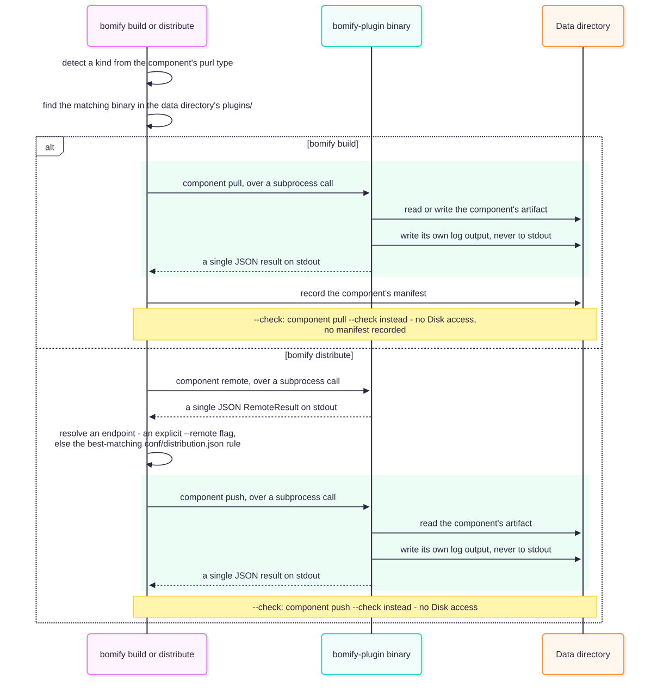

# Architecture

This document explains how bomify is put together internally: the on-disk
data directory, the plugin architecture components are built through, how a
build's bookkeeping (manifests and tags) works, and how packages move to and
from an OCI registry or a local tarball. It's aimed at anyone modifying
bomify itself, not at CLI users — see the [README](README.md) and
[`docs/reference`](docs/reference) for that.

Diagram sources live under [`docs/diagrams`](docs/diagrams) as standalone
`.mmd` files (openable directly in the
[Mermaid Live Editor](https://mermaid.live)); this document embeds the
`.svg` rendered from each. After editing a `.mmd` file, regenerate its
`.svg` with `make diagrams`.

## Mental model

bomify's design deliberately mirrors Docker's: a **package** is built from a
CycloneDX SBOM the way an image is built from a Dockerfile, a **tag** points
a human-readable name at one, and `packages`/`tag`/`package rm`/`save`/`load`
all have a direct Docker analogue (`images`/`tag`/`rmi`/`save`/`load`). The
things Docker calls "layers" are here the individual **components** an SBOM
describes — each pulled independently, cached independently, and reused
across builds by content hash.

Every component's actual fetch/build/publish logic lives outside bomify
itself, in an external plugin binary — bomify only orchestrates: parse the
SBOM, dispatch each component to the right plugin, and record what happened.

## Data directory

Everything bomify reads or writes lives under one directory (`~/.bomify` by
default, or `--data-dir`):

*Source: [`docs/diagrams/data-directory.mmd`](docs/diagrams/data-directory.mmd)*

`conf/distribution.json` records `bomify distribute`'s remote-endpoint
rules (see [`internal/distribution`](internal/distribution) and `bomify
distribution create`) — a fallback for any component not given a matching
`--remote` on the command line.

`conf/trust.json` records signature verification rules (see
[Signing & verification](#signing--verification) and `bomify trust
create`) — which packages `bomify pull`/`bomify load` must verify, and
with which signing plugin and options, whenever `--verify` isn't given.
A rule's options are either plain `key=value` pairs or `keyOptions`
naming stored keys (see `keys/` below). Its `match` is ranked
most-specific-first on `/` segment boundaries, exactly like a
distribution rule's (both share [`internal/prefix`](internal/prefix)).

`conf/scan.json` records vulnerability scanning policy rules (see
[Vulnerability gating](#vulnerability-gating) and `bomify security
policy create`) — for packages matching each rule, the scanning plugin
to use, the severity at or above which a scan fails, and the names of
the stored VEX documents (see `vex/` below) that exempt
vulnerabilities from it. Its `match` is ranked exactly like
`trust.json`'s, through the same [`internal/prefix`](internal/prefix).

Two independent things share the flat `manifests/` directory and the same
`<hash>.json` naming scheme, distinguished only by which hash space they're
keyed on:

- **A build's own manifest** (see [`internal/build`](internal/build)) is the
  original SBOM file itself, copied verbatim and keyed by its SHA-256
  content hash. This is what `repositories.json` tags point at.
- **A component's pull manifest** (see [`internal/plugin`](internal/plugin))
  records one component's SBOM entry (with its computed hash merged in) and
  is keyed by a hash of that component's purl (`plugin.PurlHash` — this
  stays in `internal/plugin` since it's bomify's own on-disk layout, not
  part of the plugin-facing contract). This is what makes an identical
  component pulled by two different SBOMs — or the same SBOM built twice
  — get reused instead of re-pulled. `internal/oci/pull` writes this same
  manifest for a component restored from a registry, so a later `bomify
  build` needing the same purl reuses it too.

`vulnerabilities/<purlHash>.json` is one component's vulnerability
report, written by `bomify security scan` (see
[Security scanning](#security-scanning) and
[`internal/security`](internal/security)) and keyed by the same purl
hash as that component's pull manifest and layers directory — so a
component shared by two packages shares one report, just as it shares
one pulled layer. It lives in its own directory rather than
`manifests/`, since unlike a pull manifest it's replaced on every scan.

`vex/` and `keys/` are managed stores of material rules refer to by
name, both built on [`internal/namedstore`](internal/namedstore): each
entry an immutable copy at `<store>/<sha256><ext>`, keyed by its
content hash, and `<store>/index.json` mapping each name to one. Rules
name entries rather than pointing at files, so they keep working
however the originals move, and travel with the data directory;
re-adding a name is the only way its content changes (e.g. rotating a
key). A copy is deleted once no name refers to it, and a name can't be
removed while a rule still uses it.

- `vex/` (`<sha256>.vex`) holds the VEX documents scan policy rules
  list (`bomify security vex add|list|remove`). `bomify security scan
  --vex <path>` bypasses it, reading the file as it is.
- `keys/` (`<sha256>.pem`) holds the public keys and certificates trust
  rules' key options name (`bomify trust key add|list|remove`). Only
  public material is accepted: a file containing any `PRIVATE KEY` PEM
  block is refused, so signing keys never end up in the data directory.
  `--option key=<path>`, on `bomify trust create` and as
  `--verify-option`, still reads a key file directly, without the
  store.

`plugins/` holds every installed plugin binary, `bomify-plugin-<kind>`
(`.exe` on Windows) — the only place bomify ever looks for one
(`plugin.Find`; `PATH` is never consulted) — plus `installed.json`,
recording which package `bomify plugin install` installed each from (see
[Plugin installation](#plugin-installation)). A binary placed there by
hand, or by `make install`, works just the same; it simply has no
`installed.json` entry.

`logs/<purlHash>.log` is a plugin's own log output for one pull/push/remote
invocation for that component, named after the same purl hash as its
manifest and layers directory — but unlike everything else here, it's
transient: it exists only for the duration of that invocation and is
removed once the plugin exits. See [Plugin architecture](#plugin-architecture)
below.

Everything is content-addressed and every write that matters is atomic (a
temp file/directory renamed into place once fully written and verified, see
`internal/oci/pull`), so a crash mid-write never leaves a corrupt manifest or
layer behind — only ever a missing one, which just triggers a redo.

## Plugin architecture

A `bomify-plugin-<kind>` binary can implement any, all, or none of four
entirely independent plugin classes:

- **Component plugins** — `component pull`/`component push`/`component
  remote`, described below, which `bomify build`/`bomify distribute` use
  to fetch and publish the individual components an SBOM describes.
- **SBOM generation plugins** — `sbom generate`, described in its own
  subsection [further down](#sbom-generation), which `bomify sbom
  generate` delegates to in order to build a fresh SBOM for a deployment
  medium. It shares nothing with the component contract beyond the
  `bomify-plugin-<kind>` binary-naming/discovery convention.
- **Security scanning plugins** — `security scan`, described
  [further down](#security-scanning), which `bomify security scan`
  calls once per component of a built package (concurrently, like
  `bomify build`/`bomify distribute`) to write each component's own
  vulnerability report. Here
  `<kind>` names a scanning tool (e.g. `grype`) rather than a purl type
  or deployment medium — the same binary scans every component in the
  SBOM, regardless of its own purl type.
- **Signing plugins** — `signature sign`/`signature verify`, described
  [further down](#signing--verification), which `bomify push --sign`/
  `bomify save --sign` and `bomify pull`/`bomify load` use to sign a
  whole package and verify it before restoring it. Here `<kind>` names a
  signing scheme (e.g. `sigstore`).

### Component plugins

Neither `bomify build` nor `bomify distribute` know how to fetch or publish
anything themselves. For each SBOM component they:

1. **Detect** a "kind" from the component's purl type (`plugin.Detect`) —
   `pkg:oci/nginx@1.27` is kind `oci`, `pkg:helm/...` is kind `helm`, and so
   on. A component with no purl, or an unparseable one, fails immediately.
2. **Find** a `bomify-plugin-<kind>` executable in `<data-dir>/plugins`
   (`plugin.Find`). A `pkg:bomify-plugin/...` component is the one
   exception to this whole list: it's a plugin binary itself, which
   `bomify build` copies in on its own rather than delegating (see
   [Plugin installation](#plugin-installation)), and `bomify distribute`
   skips, having nowhere to republish it.
3. **Delegate** to it via a small subprocess contract: `component pull`/
   `component push` subcommands taking
   `--purl`/`--output`/`--hash`/`--log`/`--log-color` or
   `--purl`/`--input`/`--remote`/`--log`/`--log-color`, the plugin doing the
   real work and reporting a single JSON `{outputPath, message, hash}`
   object on stdout. `bomify distribute` additionally calls a `component
   remote` subcommand (`--purl`/`--log`/`--log-color`) before `component
   push`, to learn where a component's content currently lives — a pure,
   stateless query reporting `{remote}` — and resolves the actual
   destination itself: an explicit `--remote <kind>=<endpoint>` flag
   first, else the best-matching rule in `conf/distribution.json` (see
   [`internal/distribution`](internal/distribution)), whose `--match`
   compares against exactly what `remote` reported.

A plugin must never write general logging to stdout (reserved for that one
JSON result) or stderr (reserved for a single fatal message bomify surfaces
on failure) — instead it logs to the file named by `--log`,
`<baseDir>/logs/<purlHash>.log` (`pkg/plugin`'s `plugin.OpenLog` gives a ready-made
`*slog.Logger` for this, in bomify's own `tint`-based format). `--log-color`
tells the plugin whether to include ANSI color codes in that output;
bomify sets it to whether its own stdout is a terminal
(`logging.SupportsColor`), since only bomify — which streams the file
there — knows whether that matters. `plugin.Pull`/`plugin.Push` create the
log file fresh before invoking the plugin and, only when bomify itself is
run with `--verbose`, stream its content live to bomify's own stdout —
each line prefixed with `[<verb> <purl>]` so lines from concurrent
pulls/pushes streaming at once stay distinguishable — as the plugin writes
to it. Either way, the file exists solely to make that streaming
possible — it's not a persistent log, and is deleted again once the
plugin exits, whether it succeeded or failed.

Both `bomify build --check` and `bomify distribute --check` skip step 3's
real transfer: they pass `--check=true` (and neither `--output` nor
`--input`) to `pull`/`push`, asking the plugin to do the cheapest
verification it can — existence and authorization — that a real
pull/push would succeed, without touching any content. `plugin.CheckPull`/
`plugin.CheckPush` are the stateless counterparts of `plugin.Pull`/
`plugin.Push` this uses: like `remote`, a check never creates a pid file,
manifest, or component directory, and `bomify build --check` records
nothing afterward, since nothing was actually pulled.

See [`plugins/README.md`](plugins/README.md) for the first-party plugins
bomify ships (`oci`, `helm`, `generic`), and
[`plugins/COMPONENT-CONTRACT.md`](plugins/COMPONENT-CONTRACT.md) for the full, authoritative
specification of the component contract above — required/optional flags,
`--check` mode, the exact `Result` JSON schema, valid hash algorithm
names, and the logging contract — that a third-party plugin must
implement.

*Source: [`docs/diagrams/plugin-dispatch.mmd`](docs/diagrams/plugin-dispatch.mmd)*

### SBOM generation

`bomify sbom generate <kind> [flags]` (`cmd/sbom.go`) is a much thinner
piece of orchestration than the component dispatch above: it looks up
`bomify-plugin-<kind>` in `<data-dir>/plugins` (the same `plugin.Find` component
dispatch uses) and execs it as `bomify-plugin-<kind> sbom generate
[flags]`, wiring the plugin's stdin/stdout/stderr directly to bomify's
own and propagating its exit code — nothing more. `flags` is passed
through completely unparsed; bomify imposes no flags, JSON result shape,
`--log` file, `--check` mode, caching, or concurrency control here, unlike
the component contract above. This is deliberate: a plugin's `sbom
generate` must be just as usable run directly
(`bomify-plugin-<kind> sbom generate [flags]`) as through
`bomify sbom generate <kind> [flags]`, since bomify contributes nothing
to the operation beyond locating the binary. See
[`plugins/SBOM-CONTRACT.md`](plugins/SBOM-CONTRACT.md) for the full
(intentionally minimal) contract, and the note at the top of [Plugin
architecture](#plugin-architecture) above for why this is a wholly
separate plugin class from component plugins, not a variant of it.

### Security scanning

Unlike `sbom generate`, `bomify security scan <type> <tag>`
(`cmd/security.go`) is orchestration much closer in shape to the
component dispatch above — bomify does real work here, not just
delegation:

1. **Resolve** `<tag>` to a locally recorded package
   (`build.ResolveTag`) and walk every component its SBOM manifest
   describes — the same manifest `bomify build`/`bomify pull`/`bomify
   load` record.
2. **Find** a single `bomify-plugin-<type>` executable in `<data-dir>/plugins`
   (`plugin.Find`) — `<type>` names the scanning tool itself (e.g.
   `grype`, `trivy`), not a purl type or deployment medium, so the same
   binary scans every component regardless of its own purl type.
3. **Query** that binary's `security supported-components` once
   (`plugin.SupportedComponents`) to learn which component purl types it
   can scan. A component whose purl type (`plugin.Detect`, the same
   detection component dispatch uses) isn't in that list — or can't be
   detected at all — is skipped with a log line, never dispatched to
   `security scan`. A purl the SBOM lists more than once is only
   scanned once.
4. **Delegate**, once per remaining component, up to `--concurrency` at
   a time (`forEachComponent` — the same concurrent-walk helper `bomify
   build`/`bomify distribute` use): call `security scan --purl <purl>`
   (`plugin.Scan`) and parse its JSON result, a `pluginlib.SecurityResult`
   object: a list of CycloneDX `Vulnerability` objects (the plugin sets
   each one's `affects` itself — to the purl it was given, or, if it had
   to unpack that purl into smaller pieces to scan it at all, to the
   specific piece(s) affected) plus, optionally, the pieces themselves as
   CycloneDX `Component` objects.
5. **Record** each component's result as its own CycloneDX document
   (`security.NewReport`), written atomically to
   `vulnerabilities/<purlHash>.json` (`security.WriteReport`),
   replacing whatever an earlier scan left there:
   - its `metadata.component` is the scanned component itself, its
     `bom-ref` set to its purl — for a directly scanned purl (`npm`,
     `pypi`, ...), that's exactly what every `affects` names;
   - its top-level `components` are whichever of the pieces the plugin
     unpacked the component into some `affects` actually names — for an
     `oci`/`docker` image, the affected packages cataloged inside it
     (never the full inventory the plugin reported), with the image
     itself remaining the metadata component — and empty otherwise;
   - its `vulnerabilities` are exactly what the plugin reported. bomify
     never merges, sets, or overwrites them, `affects` included;
   - its `metadata.timestamp` is when the scan ran and its
     `metadata.tools` names the scanning plugin — the scan time is what
     dates the package's report referrer when it's pushed (see below).

Nothing in a report is specific to the package it was scanned through
(not even the SBOM's own `bom-ref` for the component), which is what
lets every package describing the same purl share it. A plugin never
opens the package's SBOM or sees another component's result — see
[`plugins/SECURITY-CONTRACT.md`](plugins/SECURITY-CONTRACT.md) for the
full contract this implements one side of.

`bomify package vulnerabilities <tag>` (`cmd/package.go`) is the read
side: it resolves `<tag>` the same way `security scan` does, then
writes a single JSON array to stdout — parsable straight through `jq`,
unlike `package manifest`'s bare single document — with one element
per matching component: its report, read straight off disk as a
`json.RawMessage` (so its field values are never re-parsed, reordered,
or round-tripped through the CycloneDX library) and re-indented, along
with the rest of the array, so the root brackets sit at column 0 and
everything else nests two spaces per level under it regardless of how
it was formatted on disk. Elements follow the SBOM's own component
order; a component with no report (never scanned, or unsupported by
whatever scanned it) is silently skipped, and a purl the SBOM lists
more than once contributes only one element.
`--purl` (repeatable) narrows this to specific components instead of
the whole package. Nothing but that array ever reaches stdout — no log
line, not even for a `--purl` matching nothing, which goes to stderr
as a warning instead.

#### Vulnerability gating

A scan can also fail the command, rather than just record reports.
`security.Gate` (`internal/security/gate.go`) is a severity threshold —
`info` < `low` < `medium` < `high` < `critical` — plus a list of
vulnerability IDs to ignore and, optionally, VEX statements; a package
fails it when any report names a vulnerability at or above the
threshold that's neither ignored nor exempted by VEX. A
vulnerability's severity is the highest its CycloneDX `ratings` give
it, so ratings with no severity (the EPSS and CISA KEV scores
`bomify-plugin-grype` adds) never count either way, and one rated only
`none`/`unknown`, or not rated at all, never fails a gate.

`bomify security scan` (`cmd/scanning.go`'s `gateFlags`) decides which
gate applies to `<tag>` the same way `signature.Policy` decides which
signer must verify a package:

1. `--skip-gate`: nothing fails (warning if a rule would have).
2. `--fail-on` (plus `--ignore`): used as its threshold.
3. The most specific `conf/scan.json` rule matching `<tag>`'s
   repository (`security.Resolve`). Rules deliberately carry no list of
   vulnerability IDs to ignore: a standing exemption belongs in a VEX
   document, which records which component it applies to and why, not
   as an unexplained ID in local config. `--ignore` exempts IDs for a
   single command only.
4. Nothing matched: nothing fails.

VEX documents are evidence rather than policy, so they add up instead
of overriding each other: the matching rule's stored documents (see
`vex/` under [Data directory](#data-directory)), then `--vex`'s files,
apply whichever of the above set the threshold.

##### VEX

`security.LoadVEX` (`internal/security/vex.go`) holds every statement
as [go-vex](https://github.com/openvex/go-vex)'s OpenVEX model, the
reference OpenVEX implementation (grype builds on it too), whatever
format it came from. go-vex reads OpenVEX (JSON or YAML, any version)
and CSAF VEX itself. CycloneDX VEX — a CycloneDX JSON BOM whose
vulnerabilities carry an `analysis` — is converted into the same
statements: `not_affected`/`false_positive` become `not_affected`,
`resolved`/`resolved_with_pedigree` become `fixed`, `exploitable`
becomes `affected`, and `in_triage` becomes `under_investigation`. Its
`affects` refs may be bom-refs or BOM-Links, which resolve to purls
through the document's own components. `not_affected` and `fixed`
exempt a vulnerability; `affected` and `under_investigation` don't.

A finding is exempted only if **every** piece it affects is. Each
`affects` entry in the report is one target (the component itself, for
a directly scanned purl; each affected package, for an image), and a
statement covers a target when its product is that target or the
scanned component, and — if it names subcomponents — the target is one
of them. So "not affected in the image" clears the vulnerability
everywhere inside it, while "not affected in openssl" leaves it
standing if it also affects zlib there. Matching itself is go-vex's
(`Statement.Matches`), including its purl rules: a statement's purl
with no version matches every version, and qualifiers only need to
match when the statement gives them, so a statement written as
`pkg:apk/alpine/openssl@3.1.0-r0` still matches a report's
`...@3.1.0-r0?arch=x86_64`. Vulnerability IDs match through a
statement's aliases and a report's `references` alike (e.g. a GHSA and
its CVE). Where statements disagree,
the last applicable one wins: documents in the order given, and OpenVEX
statements by timestamp. An `analysis` already in the report (one a
scanner recorded) counts first, as the earliest statement.

Exemptions are never silent: each is logged with the statement's
status, justification, and source document — a `--vex` file's path, or
a stored document's `vex/<sha256>.vex` copy. Reports themselves are
never changed by VEX — they stay the raw scan result, and VEX only
decides what fails.

The scan itself is `security.Scan`, which returns each component's
report rather than writing it, so the caller decides whether and when
to keep them; `security scan` writes every report first, then checks
the gate, so a failing package's reports are still there to inspect.
A failure prints a table of every offending vulnerability (severity,
ID, component purl) to stderr and exits non-zero.

#### Reports in a registry

Reports travel with a package as an **OCI referrer** of its manifest,
never as part of the manifest itself (`security.Attach`, called by
`push.Push` — and so by `save` — right after the package is packed and
signed, before it's tagged). A scan is a snapshot of vulnerability data
that goes stale on its own, so it's the one part of a package expected
to change after the package is published; keeping it out of the
manifest means re-scanning never changes the package's digest, and so
never orphans a signature over it.

- **Attach**: every component's local report becomes one layer (media
  type `application/vnd.bomify.component.vulnerabilities.v1+json`,
  annotated with its purl, in SBOM order) of a single referrer of
  artifact type `application/vnd.bomify.vulnerabilities.v1+json`,
  annotated `land.bomify.scan.plugin` and dated
  (`org.opencontainers.image.created`) by the newest report's own scan
  time — never the push time. The referrer is built from nothing but
  the reports, so pushing again without re-scanning reproduces it
  byte-for-byte and attaches nothing new; re-scanning and pushing
  again attaches a newer one alongside. With `--sign`, the referrer is
  signed exactly like the package (its own signature referrer, whose
  subject is the report referrer).
- **Restore** (`pull`, `load`): after the package itself is restored,
  `pull` lists its report referrers (`security.Referrers`, newest
  first) and restores only the newest one's reports to
  `vulnerabilities/<purlHash>.json`, replacing whatever was there — once
  the same `transfer.Verifier` the package passed accepts the referrer.
  Reports are advisory, so failing to list, verify, or fetch them never
  fails the pull: the reason surfaces as `Result.ReportsSkipped` and a
  warning, and nothing of those reports is written.
- **Prune**: once it has attached a referrer, `push` deletes all but the
  newest `--keep-reports` (default 1; 0 disables it) report referrers
  from the registry (`security.PruneReferrers`), each after anything
  referring to it in turn — its signature — so no signature is ever
  orphaned; a report whose signature couldn't be deleted is left in
  place too. Only report referrers are ever candidates: the package's
  own signatures and anything another tool attached are left alone.
  Deletion goes through `remote.Repository.Delete`, which also updates
  the referrers tag-schema index on a registry without the Referrers
  API. It's best-effort: a registry that refuses manifest `DELETE`
  (ghcr.io answers 405) or credentials without delete permission only
  log a warning, since a stale referrer is harmless — `pull` always
  takes the newest. `bomify security prune <ref> [--keep n]` runs the
  same pruning on its own, failing instead of warning. A `save` tarball
  needs none of this: it's built from a fresh layout every time, so it
  only ever holds the current reports.

### Signing & verification

A package is signed as a whole, never component by component: what's
signed is its OCI manifest (see [Push & pull](#push--pull-oci-registry)),
which already pins the SBOM config and every component layer by
digest — so one signature transitively covers all of them, and
verifying it plus the per-blob digest checks `pull` already does is
enough to trust everything restored. Vulnerability reports live in a
referrer of their own (see [Reports in a
registry](#reports-in-a-registry)), which is signed and verified the
same way, separately, through the same two hooks. Signatures
are never embedded in the SBOM itself: its content hash is the build's
identity (see [Build & tagging](#build--tagging)), so it stays
byte-for-byte what `bomify build` recorded.

[`internal/signature`](internal/signature) holds bomify's side of this,
wired into `push.Push` and `pull.Pull` as two optional hooks
(`transfer.Signer`/`transfer.Verifier`), so `save`/`load` inherit them
unchanged:

- **Signing** (`push --sign <kind>`, `save --sign <kind>`): once the
  package manifest is packed, but **before** the tag is updated,
  bomify writes a small payload — the manifest's `mediaType`, `digest`,
  and `size` as JSON (`internal/signature`'s `writePayload`) — to a
  file, calls the plugin's `signature sign` on it (`plugin.Sign`), and
  pushes the envelope it returns as an **OCI 1.1 referrer**: a
  manifest of the plugin's own artifact type whose `subject` is the
  package manifest and whose one layer is the envelope. A failed sign
  therefore never leaves a tag pointing at an unsigned package. The
  report referrer, if any, is signed the same way before tagging too.
  The payload deliberately omits `artifactType`, which a registry doesn't
  report when resolving a tag, so the payload computed at pull time is
  byte-identical.
  Against a registry without the Referrers API (e.g. ghcr.io), oras
  falls back to the referrers tag schema and retags the
  `sha256-<digest>` index; bomify sets `SkipReferrersGC` so the
  superseded index is left untagged rather than `DELETE`d, which such
  registries often refuse (ghcr.io answers 405).
- **Verifying** (`pull`, `load`): right after resolving the reference,
  **before anything is fetched or written**, `signature.Policy` decides
  which plugin (if any) must verify it — `--verify <kind>` first, else
  the most specific `conf/trust.json` rule matching the reference's
  repository, else none (and `--insecure-skip-verify` overrides a
  matching rule, with a warning). An explicit `--verify` replaces
  `trust.json` outright for that command (its plugin and
  `--verify-option`s are used, a matching rule's are not), and rules
  only apply when no flag is given. A rule's key options are resolved
  as rules are read (`signature.ReadResolved`): each `option → key
  name` becomes a plain `option=<path of the stored copy>`, so the
  plugin sees exactly what it would for `--option`. If one must, bomify
  lists the
  manifest's referrers (`registry.Referrers` — the Referrers API or its
  tag-schema fallback against a registry, the layout's own graph for a
  tarball), keeps those whose artifact type the plugin's `signature
  supported-types` lists, and asks the plugin's `signature verify`
  about each envelope in turn until one passes. None passing fails the
  pull with nothing written to the data directory; everything fetched
  afterward is fetched by that same verified descriptor. The newest
  report referrer goes through the same policy before its reports are
  restored, but failing it only skips the reports (see [Reports in a
  registry](#reports-in-a-registry)).

*Source: [`docs/diagrams/signing.mmd`](docs/diagrams/signing.mmd)*

*Source: [`docs/diagrams/verification.mmd`](docs/diagrams/verification.mmd)*

The plugin never talks to a registry: bomify pushes and fetches every
envelope itself, which is what lets the same plugin work for a registry
and for a `save` tarball alike. See
[`plugins/SIGNING-CONTRACT.md`](plugins/SIGNING-CONTRACT.md) for the
full contract.

### Plugin installation

Plugins are themselves distributed as bomify packages. What makes a
package a *plugin* package is its SBOM: it describes the plugin's
binaries as components of purl type `bomify-plugin`
(`plugin.PurlType`), e.g.
`pkg:bomify-plugin/oci@v1.2.0?os=linux&arch=amd64` — one per platform,
the `os`/`arch` qualifiers in `GOOS`/`GOARCH` terms (`plugin.Binary`).
bomify handles that purl type itself at both ends, never through a
`bomify-plugin-<kind>`:

- **Publishing** (`bomify build`): `plugin.PullBinary` copies the binary
  from the local path or `file://` URL in the component's `distribution`
  external reference (resolved against the SBOM's own directory) into
  `layers/<purlHash>/bomify-plugin-<kind>[.exe]`. It shares `plugin.Pull`'s
  pid-file/manifest bookkeeping (`pull`) — only the fetch step differs —
  so reuse, concurrency, and SBOM-declared hash verification all behave
  identically; `--check` (`plugin.CheckBinary`) just hashes the source
  file. The result pushes, signs, and saves like any other package.
- **Installing** (`bomify plugin install <name>`,
  [`internal/plugin/install`](internal/plugin/install)): resolve
  `<registry>/<name>:<version>` (`--registry` defaulting to
  `ghcr.io/alejandro-velasco/bomify/plugins`) and pull it — so every
  blob is digest-verified and the optional signature `Verifier` runs
  before anything is fetched — into a staging directory *inside*
  `plugins/`, rather than into the data directory proper: a plugin
  package is never recorded as a local package. The pull is
  `pull.PullLayers`, which skips every layer whose purl isn't a
  `bomify-plugin` binary for this machine's OS/arch, so installing from
  a package carrying every platform's build downloads only one
  platform's. `install.Install` then
  walks the SBOM for `bomify-plugin` components matching this machine's
  OS/arch (at most one per kind), checks each binary against its
  component's declared SHA-256, and only once every one has passed
  renames them into `plugins/` (a same-filesystem rename, replacing any
  earlier install) and records them in `plugins/installed.json`. A
  failed pull or verification installs nothing, and the staging
  directory is always removed.

The first-party plugins are published this way on every release:
`make plugin-packages` ([`hack/pluginpackages`](hack/pluginpackages))
cross-compiles each plugin for every release platform and writes its
SBOM, one `bomify-plugin` component per binary (plus a `docker` alias
component in `oci`'s package, pointing at the same binary), and `make
push-plugin-packages` ([`hack/push-plugin-packages.sh`](hack/push-plugin-packages.sh))
builds and pushes each as `<registry>/<kind>:<version>` and `:latest`,
signing them, and writes each package's pinned reference
(`<repository>@<digest>`, as `bomify push --quiet` prints it) to
`plugin-digests.txt`.

Releases run in their own workflow,
[`release.yml`](.github/workflows/release.yml), only after the Build
workflow passes on `main` (releasing the exact commit Build tested), so
the signer identity names the release rather than the workflow every
push and pull request runs. It's split into three jobs so that only one
can sign, and that one runs no third-party npm code:

- `release` runs semantic-release ([`.releaserc.json`](.releaserc.json))
  to version, tag, publish the GitHub release, and push the container
  image — with no `id-token` permission.
- `sign-plugins` runs `make plugin-packages` and `make
  push-plugin-packages` with `PLUGIN_SIGN_KEYLESS=true`, and is the only
  job granted `id-token: write`. Right before every push, the script
  requests a fresh GitHub Actions OIDC token for the job — tokens only
  last minutes, far less than a whole release — checks it isn't about to
  expire, and hands it to `bomify-plugin-sigstore` as
  `SIGSTORE_ID_TOKEN`; the plugin itself knows nothing about GitHub, only
  generic OIDC tokens. It exchanges the token with Sigstore's Fulcio for
  a short-lived certificate naming the workflow —
  `https://github.com/alejandro-velasco/bomify/.github/workflows/release.yml@refs/heads/main`
  — with the signature logged in Rekor. No key exists to store, rotate,
  or leak.
- `publish-digests` attaches `plugin-digests.txt` to the GitHub release,
  for users to bootstrap `bomify-plugin-sigstore` by digest (below).

Every action is pinned to a commit SHA and every npm package to an exact
version. Whoever can change `release.yml`, `hack/`, the `Makefile`, or
the sigstore plugin on `main` can make that signature vouch for
anything, which is why [CODEOWNERS](.github/CODEOWNERS) requires the
owner's review for them — alongside branch protection on `main`, a
repository setting.

Verification (`pluginInstallPolicy`, [`cmd/plugin.go`](cmd/plugin.go))
reuses [Signing & verification](#signing--verification)'s machinery,
with one twist — the signing plugin is itself something `plugin
install` installs. It fails closed: a package is installed only if its
signature verifies, against an explicit `--verify-option` (always with
`bomify-plugin-sigstore`, which must already be installed) or else the
best-matching `conf/trust.json` rule — or if it's named by digest
(`<name>@sha256:...`), which the pull then enforces blob by blob.
Anything else is refused. bomify has no built-in signer, not even for
its own registry: the release workflow's identity above is what a
user's trust rule names to require it, and `plugin-digests.txt` is how
they install `bomify-plugin-sigstore` itself before anything can verify
it. A declared SHA-256 is also required for every binary — an integrity
check, not an authenticity one. `--verify=false` drops all of this (a
declared checksum that doesn't match still fails). `bomify plugin list`
(`install.List`) shows every `bomify-plugin-*` in `plugins/`, with its
`installed.json` entry if it has one.

### Concurrent, idempotent pulls

`plugin.Pull` is safe to call concurrently — even from separate bomify
processes — for components that hash to the same directory (duplicate purls
within or across SBOMs, or two builds racing on a shared component):

- A `manifests/<purlHash>.pid` file, containing the claiming process's PID,
  exists only while a pull for that component is in flight. A second caller
  that finds one waits on it (polling until the file disappears or the
  owning process is confirmed dead) rather than pulling again.
- A stale pid file (its process is gone without cleaning up — e.g. it
  crashed) is discarded and the pull retried fresh.
- If neither a pid file nor a manifest exists, `Pull` claims the pid file
  and invokes the plugin. If a manifest already exists and nothing is
  pulling, `Pull` reuses it — but *always* re-verifies the reused (or
  freshly-pulled) hash against whatever hash the SBOM declares for that
  algorithm, so a reused result can never silently satisfy a build call for
  a different, same-purl-but-different-hash component.

`build.RecordManifest` and `internal/oci/pull`'s downloads follow the same
pattern at their own layer: write to a temp file/directory, verify, then
atomically rename into place — so existence of the final path is always a
trustworthy "this finished successfully" signal, never a partial write.

## Build & tagging

`bomify build` pulls every component, then (`finalizeBuild`,
[`cmd/build.go`](cmd/build.go)) records the SBOM itself as this build's
manifest (`build.RecordManifest`, keyed by the SBOM's own content hash — a
build of the exact same SBOM file a second time is a no-op) and maps any
`--tag` values onto that hash (`build.UpdateRepositories`). `bomify tag`
does only the second half: point a new tag at whatever an existing tag
currently resolves to. Docker's `repositories.json` layout is followed
exactly (`repo -> tag -> id`), tag defaulting to `latest` when a `--tag`/
argument has no `:version` suffix.

### Pruning

`bomify package prune` (and `package remove`, which prunes automatically
after untagging) reclaims anything unreachable — mirroring `docker image
prune`. For each tag in `repositories.json` it marks two things "kept": the
tagged SBOM's own manifest (by its content hash), and the purl hash of every
component that SBOM's manifest describes. Everything under `manifests/`,
`layers/`, and `vulnerabilities/` that walk never reaches is removed, except anything with a live
`.pid` file (a pull might be in progress for it), which is left alone and
reported as **Skipped** instead. A component shared by two tags — its
vulnerability report included — survives as long as either tag does.

The one subtlety is a tagged manifest that exists but fails to parse — e.g.
on-disk corruption or a truncated write. That's different from a manifest
that's simply missing (nothing pulled for it yet, so nothing to protect
either way): here there really are components the SBOM describes, but
`Prune` can't identify them, so it can't mark them kept. Left unhandled,
those components would look unreachable and get silently deleted even
though a tag still points at that build. `Prune` instead reports the SBOM's
hash in `PruneResult.Unprotected`, and both `package prune` and `package
remove` log a warning for each one so the gap is visible rather than
silent — see `internal/build/prune.go`'s `markComponents`.

*Source: [`docs/diagrams/prune.mmd`](docs/diagrams/prune.mmd)*

## Push & pull (OCI registry)

`bomify push`/`bomify pull` ([`internal/oci/push`](internal/oci/push),
[`internal/oci/pull`](internal/oci/pull)) map a bomify package onto a
regular OCI artifact, so it's just as inspectable/copyable as any other OCI
image with generic tooling:

*Source: [`docs/diagrams/oci-artifact.mmd`](docs/diagrams/oci-artifact.mmd)*

- The **config blob** is the SBOM manifest itself (media type
  `application/vnd.cyclonedx+json` or `+xml`, sniffed from content).
- Each **layer** is a tar of whatever `bomify build` wrote under
  `layers/<purlHash>/` for that component (a single file or a whole
  directory tree, depending on the plugin), annotated with
  `land.bomify.purl` so `pull` knows which purl hash to unpack it back
  under. `transfer.WriteTar` normalizes every entry's mtime and uid/gid
  (zeroed, rather than whatever the local filesystem happens to report)
  before archiving, so the tar — and so the digest `push` computes over
  it — depends only on file names, modes, and content. This matters
  because `pull` doesn't restore a layer's original mtime/uid/gid on
  unpack (see `transfer.ExtractTar`); without normalizing, re-tarring a
  layer bomify itself just pulled would produce different bytes than
  the original push even though the content never changed, making a
  later `push` of the same unchanged component re-upload it under a new
  digest every time.
- The whole thing is tagged with the OCI artifact type
  `application/vnd.bomify.package.v1+json`.
- A package pushed with `--sign` also gets one **signature referrer**
  per signing: a separate manifest whose `subject` is the package
  manifest, carrying the signing plugin's envelope as its only layer
  (see [Signing & verification](#signing--verification)). It's
  untagged and never part of the package manifest itself, so signing
  doesn't change the package's digest, and a package can accumulate
  any number of signatures.
- Local vulnerability reports ride along the same way: one **report
  referrer** per scan, whose `subject` is the package manifest and whose
  layers are the reports (see [Reports in a
  registry](#reports-in-a-registry)). Like a signature, it never changes
  the package's digest.

How that lands in a registry repository — the package manifest's
descriptors in order, and the content-addressed blobs they point at:

*Source: [`docs/diagrams/registry-layout.mmd`](docs/diagrams/registry-layout.mmd)*

And where a signature — or a report referrer, which sits there the
same way — lives alongside it, and how `pull --verify` finds it:

*Source: [`docs/diagrams/registry-signatures.mmd`](docs/diagrams/registry-signatures.mmd)*

Uploads/downloads are concurrent per layer (bounded by `--concurrency`),
each verified against its declared digest and size as it streams
(`content.NewVerifyReader`), with a real progress bar per blob
(`internal/oci/transfer.ProgressFunc`). `push` skips re-uploading a blob the
target already has (needed, not just an optimization: a local
`content/oci.Store`, unlike a registry, rejects re-pushing a digest it
already holds — which `save` relies on when multiple tags share a
component).

## Save & load

`bomify save`/`bomify load` ([`internal/oci/save`](internal/oci/save)) move
packages between machines with no registry involved at all, by reusing
`push`/`pull` unchanged against a local OCI image-layout directory instead
of a network registry — the same `oras.Target`/`oras.ReadOnlyTarget`
interfaces satisfy both, so none of the packing/unpacking logic above needed
duplicating here.

*Source: [`docs/diagrams/save-load.mmd`](docs/diagrams/save-load.mmd)*

A component shared by more than one saved tag is stored once in the
tarball, same as a registry push would dedupe it. Since `save`/`load`
are Push/Pull underneath, a package's report referrer and any signature
referrers travel inside the tarball exactly as they do through a
registry push/pull — each as an untagged manifest in the layout's
`index.json` — and `load` restores reports and verifies signatures
against them exactly as `pull` would against a registry.

## Credentials

[`internal/auth`](internal/auth) is bomify's single shared source of
registry credentials, used by `login`/`logout`, `push`/`pull` directly, and
by plugins via [`pkg/auth`](pkg/auth)'s `auth.Get`/`auth.HelperFunc`
(adaptable to a third-party SDK's own credential-helper interface, and
importable from outside this module since it's a plugin-facing library).
It reads and writes the exact same
`~/.docker/config.json` plus native OS credential store (Windows Credential
Manager, macOS Keychain, or a configured Linux helper) that `docker login`
itself uses — so a `docker login` and a `bomify login` are interchangeable.
`Login` verifies a credential against the registry before storing it
(falling back to plaintext storage, with a warning, only if no native
helper is available — matching `docker login`'s own fallback).

## Design principles

A few things worth keeping in mind when changing any of the above:

- **Content-addressing everywhere.** Manifests are keyed by SBOM hash or
  purl hash, layers and vulnerability reports by purl hash, OCI blobs by digest. This is what makes
  builds, pulls, and pushes all idempotent and safely reusable/concurrent
  without bomify needing a lock file or database — the filesystem (or
  registry) path itself *is* the cache key.
- **Atomic writes.** Every multi-step write (download, untar, manifest
  write) lands at its final path only after a temp file/directory is fully
  written and verified, via rename. A missing path is always safe to treat
  as "hasn't happened yet."
- **bomify orchestrates, plugins do the work.** The core binary has no
  code for talking to any specific package ecosystem — that boundary is
  the component plugin contract's `component pull`/`component push`/
  `component remote` JSON-over-subprocess contract specified in
  [`plugins/COMPONENT-CONTRACT.md`](plugins/COMPONENT-CONTRACT.md), which is deliberately
  minimal so a third-party plugin needs almost nothing bomify-specific to
  implement (its optional Go helper library, `pkg/plugin`, is importable
  from any module for exactly that reason). SBOM generation
  ([`plugins/SBOM-CONTRACT.md`](plugins/SBOM-CONTRACT.md)) plugins take
  this even further: bomify doesn't orchestrate them at all beyond
  locating the binary, so they're independent of this contract entirely.
  Security scanning
  ([`plugins/SECURITY-CONTRACT.md`](plugins/SECURITY-CONTRACT.md))
  plugins land in between: bomify owns the package, the per-component
  dispatch, concurrency, and reports (much like the component contract),
  but a plugin's own job — answer "what does this purl have" — is just
  as minimal as SBOM generation's. Signing
  ([`plugins/SIGNING-CONTRACT.md`](plugins/SIGNING-CONTRACT.md)) plugins
  follow the same split: bomify owns the payload, the referrers, and the
  trust policy; a plugin only turns bytes into an envelope and back.
