# Security scanning

`bomify security scan <type> <tag>` (`cmd/security.go`):

1. Resolves `<tag>` (`build.ResolveTag`) and walks its SBOM.
2. Finds `bomify-plugin-<type>`. One scanner handles every component,
   whatever its purl type.
3. Asks it once for `security supported-components` and skips any
   component whose purl type isn't listed. Duplicate purls are scanned
   once.
4. Calls `security scan --purl <purl>` per component, up to
   `--concurrency` at a time (`security.Scan`). The plugin returns
   CycloneDX vulnerabilities, each with `affects` set by the plugin: to
   the purl itself, or, for something it had to unpack (an image), to
   the affected pieces, which it also returns as components.
5. Writes each result as its own CycloneDX document
   (`security.NewReport`) to `vulnerabilities/<purlHash>.json`,
   replacing the previous one. Its `metadata.component` is the scanned
   component (`bom-ref` = purl), its `components` are the unpacked
   pieces some `affects` names, its `vulnerabilities` are exactly what
   the plugin reported, and `metadata.timestamp`/`tools` record when and
   what scanned it.

Nothing in a report depends on the package it was scanned through,
which is why packages sharing a purl share a report.

`bomify package vulnerabilities <tag>` prints the reports of a package's
components (or `--purl` ones) as one JSON array on stdout, in SBOM
order, reading each report as raw JSON so values are never re-encoded.
Components without a report are skipped; warnings go to stderr.

## Vulnerability gating

`security.Gate` (`internal/security/gate.go`) fails a package when any
report has a vulnerability at or above its threshold (`info` < `low` <
`medium` < `high` < `critical`) that isn't ignored or exempted by VEX. A
vulnerability's severity is the highest of its `ratings`; unrated,
`none`, or `unknown` never fails.

`bomify security scan` picks the gate (`cmd/scanning.go`, `gateFlags`):

1. `--skip-gate`: nothing fails (warning if a rule would have).
2. `--fail-on`, plus `--ignore`.
3. The most specific `conf/scan.json` rule matching the repository.
   Rules have no ignore list on purpose: a standing exemption belongs in
   a VEX document that says which component and why.
4. Otherwise nothing fails.

VEX adds up rather than overriding: the rule's stored documents, then
`--vex` files.

`security.Scan` returns reports instead of writing them. `security scan`
writes them all before checking the gate, so a failing package's reports
are there to inspect. A failure prints a table of the offending
vulnerabilities to stderr.

### VEX

`security.LoadVEX` (`internal/security/vex.go`) holds statements in
[go-vex](https://github.com/openvex/go-vex)'s OpenVEX model. go-vex reads
OpenVEX (JSON/YAML, any version) and CSAF. CycloneDX VEX is converted:
`not_affected`/`false_positive` → `not_affected`,
`resolved`/`resolved_with_pedigree` → `fixed`, `exploitable` →
`affected`, `in_triage` → `under_investigation`, with `affects` refs
(bom-refs or BOM-Links) resolved to purls through the document's
components. Only `not_affected` and `fixed` exempt.

A finding is exempted only if every target it affects is. A statement
covers a target when its product is that target or the scanned
component, and, if it names subcomponents, the target is one of them.
So "not affected in the image" clears a finding throughout the image,
while "not affected in openssl" doesn't clear it for zlib. Matching is
go-vex's `Statement.Matches`: a versionless purl matches every version,
qualifiers only matter when the statement gives them, and IDs match
through aliases and report `references` (GHSA ↔ CVE). Where statements
disagree, the last wins: documents in order, OpenVEX statements by
timestamp, with an `analysis` already in the report counting first.

Every exemption is logged with its status, justification, and source.
VEX never changes a report; it only decides what fails.

## Scanning on pull

`bomify pull`/`load` can scan and gate a package before writing any of
it, the one thing a separate `security scan` after the pull can't do.
They take `--scan <type>`, `--fail-on`, and `--skip-scan` (`scanFlags`);
`--ignore` and `--vex` stay on `security scan`, and pulls rely on a
rule's stored VEX. For each package, `pullScanHook` resolves:

1. `--skip-scan`: nothing (warning if a rule would have scanned).
2. The scanner: `--scan`, else the matching rule's, but only if the rule
   lists `pull` in `on` (`security.Rule.AppliesOn`).
3. The gate, as for `security scan`, under the same condition.

A scan on pull is only a gate, so scanner and threshold must come
together. The package is always scanned fresh, never judged by the
reports its publisher attached. For the same reason, a rule's `--on
pull` requires `--fail-on`.

The hook runs as `transfer.Options.Scan`: `pull.PullLayers` hands it the
SBOM, along with the target and package manifest, after verifying the
package and before writing anything, so a failure leaves nothing
behind. Its gate also honors VEX the package's publisher attached, when
it verifies (see [VEX in a registry](#vex-in-a-registry)). The fresh reports are written after the
package's own, replacing them. Scanning may need network access, which
is why nothing scans on pull unless asked.

*Source: [`docs/diagrams/scanning.mmd`](https://github.com/alejandro-velasco/bomify/blob/main/docs/diagrams/scanning.mmd)*

## Reports in a registry

Reports travel as an **OCI referrer** of the package manifest, not
inside it (`security.Attach`, called by `push.Push` after packing and
before tagging). Reports go stale and get refreshed; keeping them out of
the manifest means re-scanning never changes the package digest or
orphans its signature.

- **Attach**: one referrer (artifact type
  `application/vnd.bomify.vulnerabilities.v1+json`, annotated
  `land.bomify.scan.plugin`) with one layer per report (media type
  `application/vnd.bomify.component.vulnerabilities.v1+json`, annotated
  with its purl, in SBOM order). It's dated by the newest report's scan
  time, not the push time, so pushing again without re-scanning
  reproduces it byte for byte. With `--sign` it's signed like the
  package.
- **Restore**: after restoring the package, `pull` takes the newest
  report referrer (`security.Referrers`), checks it with the same
  `transfer.Verifier` as the package, and writes its reports to
  `vulnerabilities/`. Reports are advisory: any failure only skips them
  (`Result.ReportsSkipped`, plus a warning).
- **Prune**: after attaching, `push` deletes all but the newest
  `--keep-reports` (default 1; 0 keeps all) report referrers
  (`security.PruneReferrers`), each after whatever refers to it (its
  signature), so no signature is orphaned. Nothing else is touched.
  Deletion is best-effort: registries that refuse `DELETE` (ghcr.io:
  405) only cause a warning, since `pull` always takes the newest.
  `bomify security prune` runs the same pruning on its own and fails
  instead. A `save` tarball is built fresh, so it never needs pruning.

Report referrers and VEX referrers are pushed, listed, and read through
shared helpers in `internal/oci/transfer`'s `referrer.go`:
`PushReferrer` (an empty config, the given layers, the package as
`subject`), `Referrers` (by artifact type, newest first by created
annotation), and `ReferrerLayers`/`FetchAttachment`, which cap how much
of a referrer, published by whoever could push, bomify will read.
Signature referrers are the exception: their type and envelope come
from the signing plugin.

## VEX in a registry

A publisher can attach VEX documents to a package, so their statements
travel with it: `push --vex` and `save --vex` (repeatable), each a name
in the [VEX store](data-directory.md) or else a file
(`security.ReadVEX`). Each becomes a `transfer.Attachment` in
`transfer.Options.Attach`, which `push.Push` attaches as its own
referrer (`transfer.Attach`): artifact type
`application/vnd.bomify.vex.v1+json`, one layer holding the document as
written, dated to the nanosecond so documents from one push keep their
order. A document the package already carries isn't attached again,
and with `--sign` each new referrer is signed like the package. Nothing
is attached implicitly; a rule's VEX is never published unless named.

A scan on pull honors them (`security.PublishedVEX`) only when:

1. the pull verifies signatures (`--verify` or a matching trust rule,
   `signature.Policy.Verifies`), since VEX only ever exempts, and
   anyone who can push could otherwise silence any finding; and
2. each VEX referrer passes the same `transfer.Verifier` itself.
   Unsigned or untrusted ones are skipped with a warning.

Trusted documents apply oldest first, then the rule's stored VEX
(`security.CombineVEX`), so the consumer's own statements win.
They're used by that gate only and never stored. Files, stored copies,
and pulled documents all load through `security.LoadVEXDocuments`.
